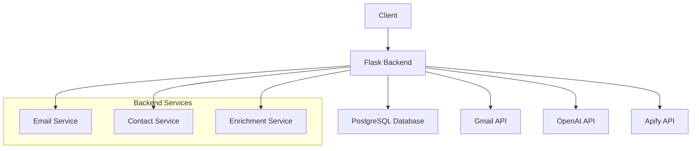
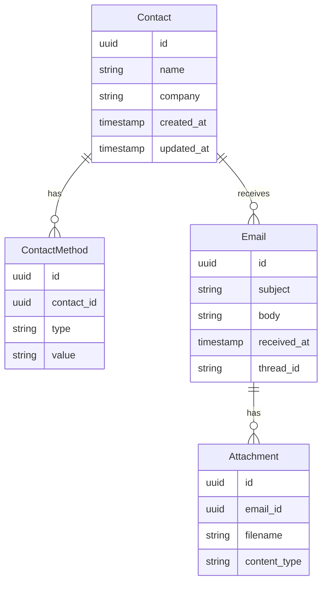

# Architecture Overview

This document provides a detailed overview of the SmartCRM application architecture.

## System Components



## Core Components

### 1. API Layer (`backend/app/api/`)
- RESTful API endpoints
- Request validation
- Error handling
- Response formatting

### 2. Services Layer (`backend/app/services/`)
- Business logic implementation
- External API integration
- Data processing and transformation

### 3. Models Layer (`backend/app/models/`)
- Database models
- Data validation
- Relationship management

### 4. Utils Layer (`backend/app/utils/`)
- Helper functions
- Common utilities
- Shared functionality

## Data Flow

1. **Contact Management**
   ```mermaid
   sequenceDiagram
       Client->>API: Create Contact Request
       API->>ContactService: Validate & Process
       ContactService->>EnrichmentService: Enrich Contact Data
       EnrichmentService->>OpenAI: Get Insights
       EnrichmentService->>Apify: Scrape Additional Info
       ContactService->>Database: Save Contact
       API->>Client: Return Response
   ```

2. **Email Synchronization**
   ```mermaid
   sequenceDiagram
       Client->>API: Sync Emails Request
       API->>EmailService: Process Request
       EmailService->>Gmail API: Fetch Emails
       EmailService->>Database: Save Emails
       EmailService->>ContactService: Update Contact Stats
       API->>Client: Return Response
   ```

## Database Schema



## Security Considerations

1. **Authentication & Authorization**
   - OAuth 2.0 for Gmail API
   - API key management
   - Role-based access control (future)

2. **Data Protection**
   - Encrypted storage
   - Secure API communication
   - Environment variable management

3. **Error Handling**
   - Graceful error recovery
   - Detailed error logging
   - User-friendly error messages

## Performance Optimization

1. **Database**
   - Indexed queries
   - Connection pooling
   - Query optimization

2. **API**
   - Response caching
   - Rate limiting
   - Pagination

3. **Background Tasks**
   - Asynchronous processing
   - Job queuing
   - Batch operations

## Future Considerations

1. **Scalability**
   - Microservices architecture
   - Load balancing
   - Horizontal scaling

2. **Features**
   - Real-time notifications
   - Advanced analytics
   - Contact grouping
   - Email templates

3. **Integration**
   - Additional email providers
   - CRM systems
   - Calendar integration 