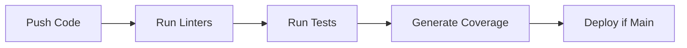

# Testing Guide

This guide covers the testing strategy and practices for the SmartCRM application.

## Testing Stack

- **pytest**: Main testing framework
- **pytest-flask**: Flask application testing
- **pytest-cov**: Code coverage reporting
- **pytest-sqlalchemy**: Database testing

## Test Structure

```
backend/
└── tests/
    ├── conftest.py          # Shared fixtures
    ├── test_routes.py       # API endpoint tests
    ├── test_services.py     # Service layer tests
    ├── test_models.py       # Database model tests
    └── test_utils.py        # Utility function tests
```

## Running Tests

### Basic Test Execution

```bash
# Run all tests
python -m pytest

# Run specific test file
python -m pytest backend/tests/test_routes.py

# Run specific test function
python -m pytest backend/tests/test_routes.py::test_create_contact
```

### Coverage Reports

```bash
# Generate coverage report
python -m pytest --cov=backend

# Generate HTML coverage report
python -m pytest --cov=backend --cov-report=html
```

## Writing Tests

### 1. API Tests

```python
def test_create_contact(client):
    """Test contact creation endpoint"""
    response = client.post("/api/contacts", json={
        "name": "Test User",
        "company": "Test Corp",
        "contact_methods": [
            {"type": "email", "value": "test@example.com"}
        ]
    })
    assert response.status_code == 201
    assert response.json["status"] == "success"
```

### 2. Service Tests

```python
def test_contact_service_create(db_session):
    """Test contact creation in service layer"""
    contact_data = {
        "name": "Test User",
        "company": "Test Corp"
    }
    contact = ContactService.create_contact(contact_data)
    assert contact.name == "Test User"
    assert contact.company == "Test Corp"
```

### 3. Model Tests

```python
def test_contact_model(db_session):
    """Test Contact model operations"""
    contact = Contact(name="Test User", company="Test Corp")
    db_session.add(contact)
    db_session.commit()
    
    assert contact.id is not None
    assert contact.name == "Test User"
```

## Test Fixtures

Common test fixtures are defined in `conftest.py`:

```python
@pytest.fixture
def app():
    """Create test Flask application"""
    app = create_app("testing")
    return app

@pytest.fixture
def client(app):
    """Create test client"""
    return app.test_client()

@pytest.fixture
def db_session(app):
    """Create test database session"""
    with app.app_context():
        db.create_all()
        yield db.session
        db.session.remove()
        db.drop_all()
```

## Mocking External Services

### Gmail API

```python
@pytest.fixture
def mock_gmail_service(mocker):
    """Mock Gmail API service"""
    mock = mocker.patch("app.services.email_service.build")
    mock.return_value.users.return_value.messages.return_value.list.return_value.execute.return_value = {
        "messages": [{"id": "123"}]
    }
    return mock
```

### OpenAI API

```python
@pytest.fixture
def mock_openai(mocker):
    """Mock OpenAI API calls"""
    mock = mocker.patch("openai.ChatCompletion.create")
    mock.return_value = {
        "choices": [{
            "message": {"content": "Mocked response"}
        }]
    }
    return mock
```

## Test Categories

1. **Unit Tests**
   - Individual component testing
   - Mocked dependencies
   - Fast execution

2. **Integration Tests**
   - Component interaction testing
   - Minimal mocking
   - Database integration

3. **API Tests**
   - Endpoint testing
   - Request/response validation
   - Error handling

4. **End-to-End Tests**
   - Complete workflow testing
   - Real external services
   - Production-like environment

## Best Practices

1. **Test Organization**
   - One test file per source file
   - Clear test names
   - Logical test grouping

2. **Test Data**
   - Use fixtures for common data
   - Avoid hard-coded values
   - Clean up test data

3. **Assertions**
   - Test one concept per function
   - Use descriptive assertions
   - Check both positive and negative cases

4. **Mocking**
   - Mock external services
   - Use context managers
   - Reset mocks between tests

## Continuous Integration

Tests are automatically run on:
- Pull request creation
- Push to main branch
- Nightly builds

### CI Pipeline



## Performance Testing

1. **Load Testing**
   - Concurrent user simulation
   - Response time measurement
   - Resource utilization

2. **Stress Testing**
   - System limits testing
   - Error handling under load
   - Recovery testing

3. **Endurance Testing**
   - Long-running tests
   - Memory leak detection
   - Resource consumption 