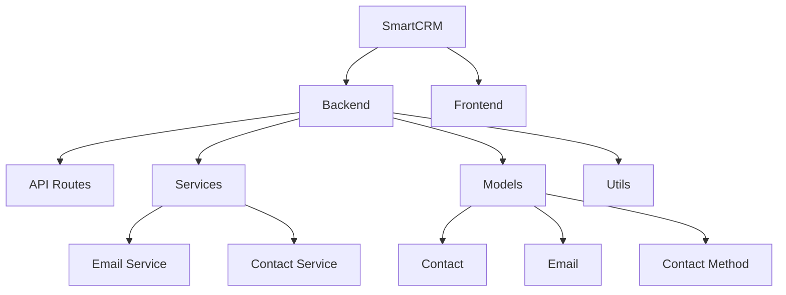

# SmartCRM Documentation

Welcome to the SmartCRM documentation. This application helps you manage professional contacts and email communications efficiently.

## Overview

SmartCRM is a Flask-based application that provides:

- Contact management with automatic information enrichment
- Email synchronization with Gmail
- Smart categorization of communications
- Professional network analytics

## Quick Links

- [Installation Guide](getting-started/installation.md)
- [API Reference](api/routes.md)
- [Architecture Overview](development/architecture.md)

## Project Structure

## Features

- **Contact Management**
  - Store and organize professional contacts
  - Automatic contact information enrichment
  - Contact categorization and tagging

- **Email Integration**
  - Gmail synchronization
  - Email threading and organization
  - Smart email categorization

- **Analytics**
  - Communication patterns analysis
  - Network visualization
  - Activity reporting

## Contributing

We welcome contributions! Please see our [Contributing Guide](development/contributing.md) for details on how to get started. 